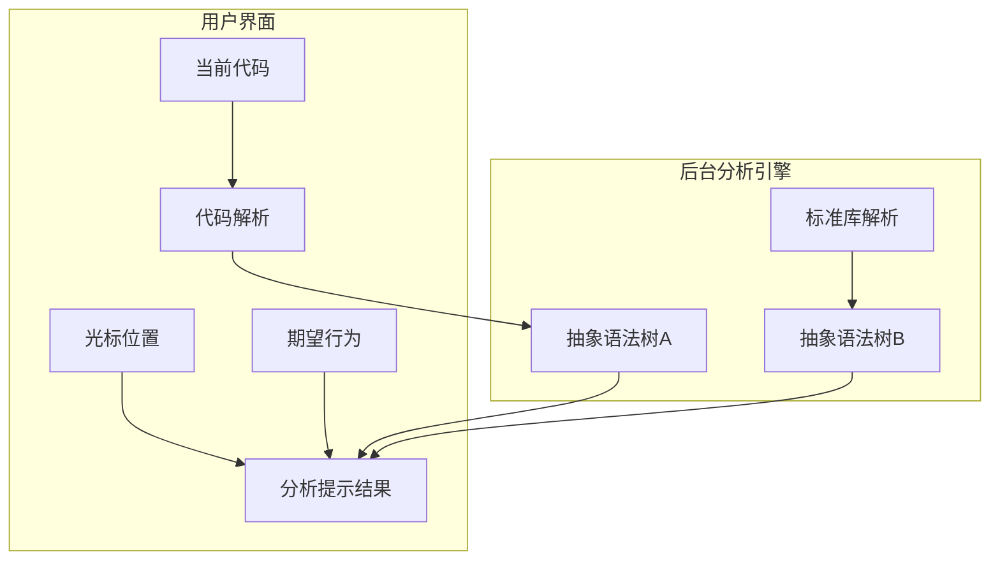

# 语言服务器简介
## 为什么需要语言服务器协议
在如今的代码开发中，众多程序员都重度依赖编辑器本身所提供的自动补全（autocomplete）、错误检查（error-checking, diagnostics），跳转到定义/实现（jump-to-definition），以及其他诸多好多的特性。
与此同时，目前各类代码编辑器也是百花齐放，有几十年历史的[emacs](https://www.gnu.org/software/emacs/)、[vim](https://www.vim.org/)，中生代的[Visual Studio](https://visualstudio.microsoft.com/)、[eclipse](https://www.eclipse.org/)、[jetbrains全家桶](https://www.jetbrains.com/)，以及近几年趋向于轻量化的[vscode](https://code.visualstudio.com/) 等等。
此外，编程语言近些年发展得比较迅猛，比如C++自从C++11后，14、17、20、23基本上三年一个版本；再比如前段时间Google刚宣布推出一门新语言：[Carbon](https://github.com/carbon-language/carbon-lang)。设想一下，如果每款编辑器都期望支持大多数主流编程语言，那么这些个编辑器都会花费大量的工作在此。
## 编辑器实现自动补全等特性的一般套路
首先，我们先分析一下代码编辑器一般如何实现类似自动补全、跳转到定义等功能。

从操作层面而言，编辑器的代码补全可以分为用户界面和后台分析引擎两部分。
当用户在界面上进行代码编辑器时，编辑器会不断在分析用户的期望行为，比如这会是期望代码补全、还是文档提示、亦或是跳转到定义等等。
然后编辑器会将当前代码、当前的光标位置、期望行为发送到后台的分析引擎。
分析引擎则会解析当前的代码，结合光标位置，得到需要代码补全的关键信息。举个例子，假设现在是Python代码中的`os.`，那么后台分析引擎通过分析就知道这会它应该去找`os`模块下所具有的属性/函数了。
那么接下来`os`下的属性/函数从哪儿来？其实也很好办，后台的分析引擎去当前工程目录和系统的标准库中找，其实又是做了一次抽象语法树的分析。当然，有时候为了高效，对当前工程目录和系统标准库的抽象语法树解析会前置。
最终，后台分析引擎给出自动补全的结果到用户界面，用户界面展示供用户选择，或者直接自动补全就完事了。
从中，我们可以看出，代码编辑器如果要实现自动补全等功能，将重度依赖对代码进行抽象语法树的分析，以及根据抽象语法树和当前光标位置和期望行为的结合，给出适当的结果。
### 编辑器实现自动补全等特性的核心技术点
从上述我们就可以看出，要将代码编辑器实现自动补全等特性，核心三个技术点：
- 用户界面的交互
- 对代码进行抽象语法树的分析
- 结合光标位置、期望行为、抽象语法树，给出适当的结果
因此，我们可以设想一下，除了用户界面的交互因为每款编辑器的实现不一样以致于很难统一和复用外，其余的所谓后台分析引擎其实完全可以设计成针对一门语言一个分析引擎，然后被不同的编辑器复用。
### 语言服务器协议（Language Server Protocol）的意义
[语言服务器协议（Language Server Protocol,LSP）](https://microsoft.github.io/language-server-protocol/)的意义也就是类似如此，它由微软最早提出，期望通过定义清楚代码编辑过程中用户所期望的编辑器能够提供的所有特性，将此定义为一套协议，称为## 语言服务器协议（Language Server Protocol，简称：LSP），那么不同语言只要实现这套协议即可，即：语言服务（Language Server）。让代码编辑器的开发者从无止境的抽象语法树等等事情中解放出来，安心做好编辑器本身。

上图摘自[vscode/Language Server Extension Guide](https://code.visualstudio.com/api/language-extensions/language-server-extension-guide)，很清楚地解释了有LSP和没有LSP对代码编辑器开发者本身的差异。
## LSP的工作过程
在我们大致弄明白了LSP的作用后，下面我们来解析一下LSP的工作过程。
## 语言服务器是若单个独立的进程
首先，代码编辑器和语言服务器是两个进程，甚至如果当前这名开发同学技术栈比较广，同时用多门语言进行开发，那么代码编辑器和语言服务器是一对多的关系，即同时存在多个针对不同语言的语言服务器进程存在。
此外，如果这名开发同学同时打开了多个项目工程目录，即使这些项目都是同一门语言，那么也有可能会打开多个语言服务器进程存在，因为每个进程需要对应到单个项目工程。
## 编辑器和语言服务器使用JSON-RPC进行通信
我们先看一下LSP的报文协议示例：
```
Content-Length: ...\r\n
\r\n
{
	"jsonrpc": "2.0",
	"id": 1,
	"method": "textDocument/didOpen",
	"params": {
		...
	}
}
```
因为代码编辑器和语言服务器是两个独立的进程，因此它们之前的通信必须定义好报文的协议。
LSP的报文协议分为`Heaeder`和`Content`两部分，然后两者之间通过`\r\n`分割（很微软的风格）。
此外，还有一点需要注意：这两个进程的通信方式本身又有两种方式：通过标准输入输出(stdin/stdout)和通过TCP通信。这其中，通过TCP通信其实是可选的，不是每一个语言服务器都一定要实现的。也就是说，标准输入/输出是必须的。
之所以采用通过标准输入/输出的方案，我个人分析是这样对编辑器的兼容性最强，正如微软最早在设计LSP时，目标就是想让Emacs和Sublime Text以支持TypeScript。
> Around the same time, Microsoft started to work on a TypeScript language server, with the idea of supporting TypeScript in editors like Emacs and Sublime Text. In this implementation, an editor communicates through stdin/stdout with the TypeScript server process and uses a JSON payload inspired by the V8 debugger protocol for requests and responses. The TypeScript server has been integrated into the TypeScript Sublime plugin and VS Code for rich TypeScript editing.
出自[Visual Studio关于Language Server Protocol的介绍](https://docs.microsoft.com/en-us/visualstudio/extensibility/language-server-protocol?view=vs-2022)

#### `Header`的格式说明
这里`Header`的格式和`HTTP Header`非常类似，Key/Value形式，通过`冒号（:）`分割。当然，多个Header之间也是得通过`\r\n`来分割。
例如：
```
Content-Length: 100
Content-Type: application/vscode-jsonrpc; charset=utf-8
```
目前只支持`Content-Length`和`Content-Type`两个字段，并且`Content-Type`是可选的，它有默认值：`application/vscode-jsonrpc; charset=utf-8`。
`Content-Type`则需要每次都先计算`Content`的实际长度。
#### `Content`的格式说明
`Content`的内容采用[JSON-RPC](https://www.jsonrpc.org/) 作为消息格式。
也正如前文所言，代码编辑器所期望的特性非常多，那么每种特性也需要交互不同的请求，每种请求发送的Message和收到响应的Message也不一样。
因此，LSP中要实现的Message确实非常多。详细的可以参考[LSP的Specification](https://microsoft.github.io/language-server-protocol/specifications/lsp/3.17/specification/)。
这边就先简单介绍一下几个基础Message接口：
```typescript
interface Message {
  // 表示 jsonrpc 的版本，在 LSP 中使用 2.0
  jsonrpc: "2.0";
}
```
`Message`是最基础的接口。
```typescript
interface RequestMessage extends Message {
  /**
   * 标识请求的 ID
   */
  id: integer | string;
 
  /**
   * 请求的方法
   */
  method: string;
 
  /**
   * 请求的参数
   */
  params?: array | object;
}
```
`RequestMessage`是客户端（编辑器）发送给服务端（语言服务器）的消息体。
```typescript
// 请求的返回，有成功和失败两种情况
type ResponseMessage = ResponseSuccessMessage | ResponseErrorMessage;
 
// 两种情况都需要包含对应的请求 ID
interface ResponseBaseMessage extends Message {
  /**
   * 返回对应的请求 ID
   */
  id: integer | string | null;
}
 
// 请求成功时，返回中携带 result 字段
interface ResponseSuccessMessage extends ResponseBaseMessage {
  /**
   * 请求成功后的结果
   */
  result: string | number | boolean | object | null;
}
 
// 请求失败时，返回中携带错误详情
interface ResponseErrorMessage extends ResponseBaseMessage {
  /**
   * 请求失败时的错误详情
   */
  error: ResponseError;
}
 
// 错误详情
interface ResponseError {
  /**
   * 错误代码
   */
  code: integer;
 
  /**
   * 错误的解释信息
   */
  message: string;
 
  /**
   * 错误的可选附加信息
   */
  data?: string | number | boolean | array | object | null;
}
```
`ResponseMessage`是客户端（编辑器）收到服务端（语言服务器）的响应的消息体。
```typescript
interface NotificationMessage extends Message {
  /**
   * 待触发的 method
   */
  method: string;
 
  /**
   * 通知的参数
   */
  params?: array | object;
}
```
除了请求消息和响应消息外，LSP还定义中一种消息类型：通知（`NotificationMessage`）。通知的工作方式和`event`类似，没有响应消息。
## 具体的通信过程
这里，我们以[LSP官网的例子](https://microsoft.github.io/language-server-protocol/overviews/lsp/overview/) 来介绍代码编辑器的语言服务器具体的通信/交互过程。

PS：上图中的`Development Tool`就是我们此文中的代码编辑器。
上图中具体的通信过程咱们展开介绍一下： ^6e18a1
- 首先当用户打开一份代码文档后，编辑器发送一个`NotificationMessage`，具体的内容：`text/Document/didOpen;Params:document`。
- 同样，用户吭哧吭哧在写代码的同时，编辑器会不断向语言服务器发送`NotificationMessage`，具体的内容为：`text/Document/didOpen;Params:{documentURI,changes}`。这里需要注意一下，`documentURI`是什么？其实很简单，就是正在被编辑的文档在路径，只不过它用`URI`来表示，这样的话，即可以表示本地文件，比如`file://`；也可以是远程文件，比如`http://`。
- 与此同时，语言服务器也不闲着，它一般也会不断地进行语法分析，以帮助用户尽早地发现一些潜在错误（`Diagnostic`）。
- 下一个场景，用户期望找到这个函数/变量的定义，于是编辑器发送`RequestMessage`，具体的内容是`Request:textDocument/defintion;Params:{documentURI,position}`。这里我们可以把这个`RequestMessage`展开看一下具体内容可能张什么样：
```json
{
	"jsonrpc": "2.0",
	"id": 1,
	"method": "textDocument/definition",
	"params": {
		"textDocument": {
			"uri": "file:///p%3A/mseng/VSCode/Playgrounds/cpp/use.cpp"
		},
		"position": {
			"line": 3,
			"character": 12
		}
	}
}
```
- 从上述的`RequestMessage`可以看出，我现在光标位置是在`file:///p%3A/mseng/VSCode/Playgrounds/cpp/use.cpp`的第3行的第12个字符的位置，我现在期望找出当前位置所在符号（symbol）的定义（`textDocument/definition`）。
- 在语言服务器收到上述的请求后，经过分析后，返回`ResponseMessage`，它的具体内容是：`Response:textDocument/definition;Params:Location`。我们还是展开看一下详细内容：
```json
{
	"jsonrpc": "2.0",
	"id": 1,
	"result": {
		"uri": "file:///p%3A/mseng/VSCode/Playgrounds/cpp/provide.cpp",
		"range": {
			"start": {
				"line": 0,
				"character": 4
			},
			"end": {
				"line": 0,
				"character": 11
			}
		}
	}
}
```
- 这样就比较清楚了，`file:///p%3A/mseng/VSCode/Playgrounds/cpp/use.cpp`中的第3行第12个字符所在的符号，它的定义是在`file:///p%3A/mseng/VSCode/Playgrounds/cpp/provide.cpp`的第0行。
- 最后一个场景，当用户关闭这个代码文档后，和打开文档类似，发送`NotificationMessage`，内容如：`Notification: textDocument/didClose; Params: documentURI`。
### LSP已定义的语言特性
在上面[[语言服务器协议（Language Server Protocol）#^6e18a1]] 中，我们核心介绍了跳转到定义（Goto-Definition）场景下代码编辑器和语言服务器之间的通信交互过程。
另外一方面，代码编辑器所期望的语言特性很多，LSP中对此也做了一系列的标准化定义，[具体可以参考LSP中的介绍](https://microsoft.github.io/language-server-protocol/specifications/lsp/3.17/specification/#languageFeatures)。
此外，既然是代码编辑器，功能自然也不局限于的代码/语言本身，因此LSP中还有一些关于[工作区（Workspace）的特性](https://microsoft.github.io/language-server-protocol/specifications/lsp/3.17/specification/#workspace_symbol)、和[窗口（Window）的特性的定义](https://microsoft.github.io/language-server-protocol/specifications/lsp/3.17/specification/#window_showMessage)。
## 示例：monaco-editor集成LSP
LSP虽然定义好了关于编程语言在语言特性、和编辑器的通信交互等等方面的一系列标准，那么编辑器在收到语言服务器给予的各类`ResponseMessage`消息后，自然就要考虑如何在编辑器中如何将这些信息确切地展示出来，以增强用户的编程体验。
因此，下面我们以微软的[monaco-editor](https://microsoft.github.io/monaco-editor/)为例，来介绍一下如何在`monaco-editor`中集成LSP。
### DEMO的目标
我们这个DEMO打算实现的功能比较简单：一个针对Python的monaco-editor的编辑器。
### LSP Client
因为LSP中定义的消息类型确实比较多，因此我们一般首先会将这些个消息做一个客户端SDK的封装，简单可以称之为：LSP-Client。
微软官方是针对JavaScript/TypeScript已经给出了这个LSP-Client，[vscode-languageclient](https://www.npmjs.com/package/vscode-languageclient)。如果需要其他语言的话，可能得再找找（LSP官方收集了一些实现：[SDKs for the LSP](https://microsoft.github.io/language-server-protocol/implementors/sdks)）, 或者干脆自己封装一个。
### monaco-languageclient
上面这个[vscode-languageclient](https://www.npmjs.com/package/vscode-languageclient) 本身只是一个对LSP消息和响应的一个封装，并不涉及monaco-editor如何触发请求和如何响应结果（在编辑器中展示等等）。
当然，这个完全可以通过调用monaco-editor的API来实现。这里，我就偷个懒，用[TypeFox/monaco-languageclient](https://github.com/TypeFox/monaco-languageclient) 已经实现了的。
### 语言服务器当前已有的实现
目前LSP官方上已经给出了诸多语言的Language Server的实现：[Implementations/Language Servers](https://microsoft.github.io/language-server-protocol/implementors/servers/)。
我们这个DEMO是针对Python语言，因此就选用：[palantir/python-language-server](https://github.com/palantir/python-language-server)。
### 具体实现方案

在这个DEMO中，我们总共需要三个组件：
- 前端页面，包含monaco-editor
- 一个Node服务，用于和页面/monaco-editor进行通信。因为LSP协议中，消息本身有很多从语言服务器端发送过来的事件（event），因此这里采用`websocket`作为通信协议。
- Python Language Server
#### Python Language Server的安装
```bash
pip install 'python-language-server[all]' --trusted-host https://repo.huaweicloud.com -i https://repo.huaweicloud.com/repository/pypi/simple
```
#### Node服务实现代码
```ts
import * as path from 'path';  
import express from 'express';  
import { WebSocketServer } from 'ws';  
import * as http from "http";  
import * as net from "net";  
import * as url from "url";  
import {IWebSocket, WebSocketMessageReader, WebSocketMessageWriter} from 'vscode-ws-jsonrpc';  
import * as server from 'vscode-ws-jsonrpc/server';  
import * as lsp from 'vscode-languageserver';  
import {Message} from 'vscode-languageserver';  
import { fileURLToPath } from 'url';  
  
const __filename = fileURLToPath(import.meta.url);  
const __dirname = path.dirname(__filename);  
  
const app = express();  
// 前端静态文件所在地址  
const rootDir = path.join(__dirname, "..");  
app.use(express.static(path.join(rootDir, "build")));  
  
const expressServer = app.listen(3000);  
  
const wss = new WebSocketServer({  
    noServer: true,  
    perMessageDeflate: false  
});  
  
expressServer.on('upgrade', (request: http.IncomingMessage, socket: net.Socket, head: Buffer) => {  
    const pathname = request.url ? url.parse(request.url).pathname : undefined;  
    if (pathname === '/lsp') {  
        wss.handleUpgrade(request, socket, head, (webSocket) => {  
            const socket2 = {  
                send: (content:any) =>  
                    webSocket.send(content, (error) => {  
                        if (error) {  
                            throw error;  
                        }  
                    }),  
                onMessage: (cb:any) => webSocket.on('message', cb),  
                onError: (cb:any) => webSocket.on('error', cb),  
                onClose: (cb:any) => webSocket.on('close', cb),  
                dispose: () => webSocket.close(),  
            };  
            // launch the server when the web socket is opened  
            if (webSocket.readyState === webSocket.OPEN) {  
                launch(socket2);  
            } else {  
                webSocket.on('open', () => launch(socket2));  
            }  
        });  
    }  
});  
  
function launch(socket: IWebSocket) {  
    const reader = new WebSocketMessageReader(socket);  
    const writer = new WebSocketMessageWriter(socket);  
    const socketConnection = server.createConnection(reader, writer, () =>  
        socket.dispose()  
    );  
    const serverConnection:any = server.createServerProcess(  
        'Python',  
        'pyls' // path to python-lsp-server called with pylsp command  
    );  
    server.forward(socketConnection, serverConnection, (message) => {  
        // console.log('server forward');  
        if (Message.isRequest(message)) {  
            if (message.method === lsp.InitializeRequest.type.method) {  
                const initializeParams = message.params;  
                // @ts-ignore  
                initializeParams.processId = process.pid;  
            }  
        }        return message;  
    });  
}
```
#### 前端页面的实现
```ts
import 'monaco-editor/esm/vs/editor/editor.all.js';  
  
// support all editor features  
import 'monaco-editor/esm/vs/editor/standalone/browser/accessibilityHelp/accessibilityHelp.js';  
import 'monaco-editor/esm/vs/editor/standalone/browser/inspectTokens/inspectTokens.js';  
import 'monaco-editor/esm/vs/editor/standalone/browser/iPadShowKeyboard/iPadShowKeyboard.js';  
import 'monaco-editor/esm/vs/editor/standalone/browser/quickAccess/standaloneHelpQuickAccess.js';  
import 'monaco-editor/esm/vs/editor/standalone/browser/quickAccess/standaloneGotoLineQuickAccess.js';  
import 'monaco-editor/esm/vs/editor/standalone/browser/quickAccess/standaloneGotoSymbolQuickAccess.js';  
import 'monaco-editor/esm/vs/editor/standalone/browser/quickAccess/standaloneCommandsQuickAccess.js';  
import 'monaco-editor/esm/vs/editor/standalone/browser/quickInput/standaloneQuickInputService.js';  
import 'monaco-editor/esm/vs/editor/standalone/browser/referenceSearch/standaloneReferenceSearch.js';  
import 'monaco-editor/esm/vs/editor/standalone/browser/toggleHighContrast/toggleHighContrast.js';  
  
import * as monaco from 'monaco-editor/esm/vs/editor/editor.api.js';  
  
import { buildWorkerDefinition } from 'monaco-editor-workers';  
  
import { MonacoLanguageClient, CloseAction, ErrorAction, MonacoServices, MessageTransports } from 'monaco-languageclient';  
import { toSocket, WebSocketMessageReader, WebSocketMessageWriter } from 'vscode-ws-jsonrpc';  
import normalizeUrl from 'normalize-url';  
import { StandaloneServices } from 'vscode/services';  
import getMessageServiceOverride from 'vscode/service-override/messages';  
  
StandaloneServices.initialize({  
    ...getMessageServiceOverride(document.body)  
});  
buildWorkerDefinition('', new URL('', window.location.href).href, false);  
  
// register Monaco languages  
monaco.languages.register({  
    id: 'python',  
    extensions: ['.py'],  
    aliases: ['python', 'PYTHON'],  
    mimetypes: ['text/x-python'],  
});  
  
// create Monaco editor  
const value = `import os  
import sys  
`;  
monaco.editor.create(document.getElementById("container")!, {  
    model: monaco.editor.createModel(  
        value,  
        'python',  
        monaco.Uri.parse('inmemory://demo.py')  
    ),  
    theme: 'vs-dark',  
    glyphMargin: true,  
    lightbulb: {  
        enabled: true  
    }  
});  
  
// install Monaco language client services  
MonacoServices.install();  
  
// create the web socket  
const url = createUrl('/lsp')  
const webSocket = new WebSocket(url);  
  
webSocket.onopen = () => {  
    const socket = toSocket(webSocket);  
    const reader = new WebSocketMessageReader(socket);  
    const writer = new WebSocketMessageWriter(socket);  
    const languageClient = createLanguageClient({  
        reader,  
        writer  
    });  
    languageClient.start();  
    reader.onClose(() => languageClient.stop());  
};  
  
  
function createLanguageClient(transports: MessageTransports): MonacoLanguageClient {  
    return new MonacoLanguageClient({  
        name: "Sample Language Client",  
        clientOptions: {  
            // use a language id as a document selector  
            documentSelector: ['python'],  
            // disable the default error handler  
            errorHandler: {  
                error: () => ({ action: ErrorAction.Continue }),  
                closed: () => ({ action: CloseAction.DoNotRestart })  
            }  
        },  
        // create a language client connection from the JSON RPC connection on demand  
        connectionProvider: {  
            get: () => {  
                return Promise.resolve(transports);  
            }  
        }    });  
}  
  
function createUrl(path: string): string {  
    const protocol = location.protocol === 'https:' ? 'wss' : 'ws';  
    return normalizeUrl(`${protocol}://${location.host}${location.pathname}${path}`);  
}
```
#### 最终的代码DEMO

#### DEMO代码
上述的完整DEMO代码在:[wuliang142857/python-lsp-monaco-editor-demo](https://github.com/wuliang142857/python-lsp-monaco-editor-demo)
#### 前端WebSocket建议使用reconnecting-websocket
在上述的DEMO中，前端使用原生的WebSocket。在实际的项目中，考虑到连接断了以后可以自动重连，可以考虑使用[reconnecting-websocket](https://www.npmjs.com/package/reconnecting-websocket)。
## 参考资源
- [语言服务器协议（Language Server Protocol,LSP）](https://microsoft.github.io/language-server-protocol/)
- [Programmatic Language Features](https://code.visualstudio.com/api/language-extensions/programmatic-language-features)
- [vscode/Language Server Extension Guide](https://code.visualstudio.com/api/language-extensions/language-server-extension-guide)