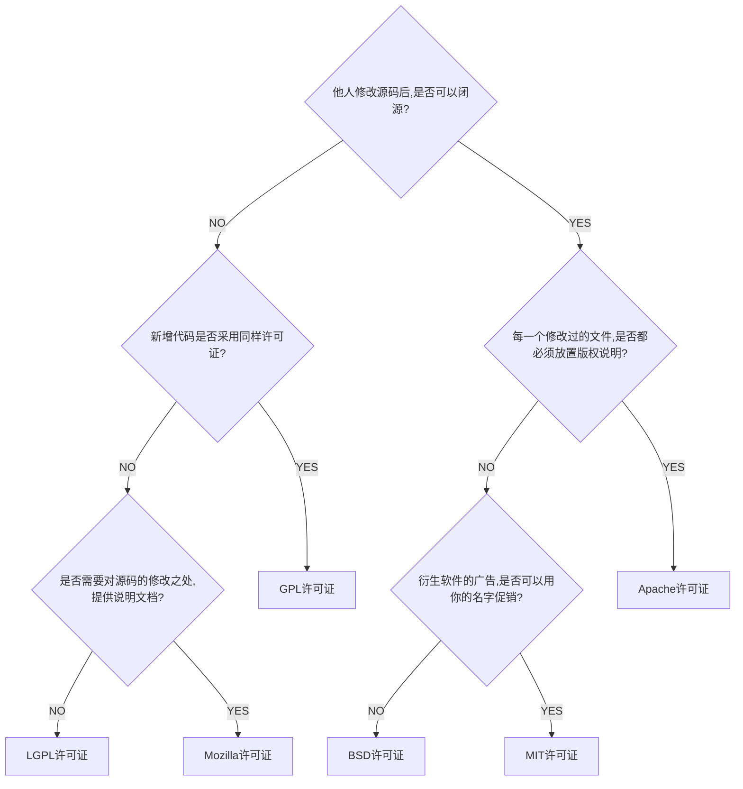

# 简单介绍开源协议

```mermaid
graph TB
	A{他人修改源码后,是否可以闭源?} -- NO --> B1{新增代码是否采用同样许可证?}
	A{他人修改源码后,是否可以闭源?} -- YES --> B2{每一个修改过的文件,是否都必须放置版权说明?}
	B1{新增代码是否采用同样许可证?} -- NO --> C1{是否需要对源码的修改之处,提供说明文档?}
	C1{是否需要对源码的修改之处,提供说明文档?} -- NO --> LGPL[LGPL许可证]
	C1{是否需要对源码的修改之处,提供说明文档?} -- YES --> MOZILLA[Mozilla许可证]
	B1{新增代码是否采用同样许可证?} -- YES --> GPL[GPL许可证]
  B2{每一个修改过的文件,是否都必须放置版权说明?} -- NO --> C2{衍生软件的广告,是否可以用你的名字促销?}
  C2{衍生软件的广告,是否可以用你的名字促销?} -- NO --> BSD[BSD许可证]
  C2{衍生软件的广告,是否可以用你的名字促销?} -- YES --> MIT[MIT许可证]
  B2{每一个修改过的文件,是否都必须放置版权说明?} -- YES --> APACHE[Apache许可证]

```

参考：

- [如何选择开源许可证？](https://www.ruanyifeng.com/blog/2011/05/how_to_choose_free_software_licenses.html)

